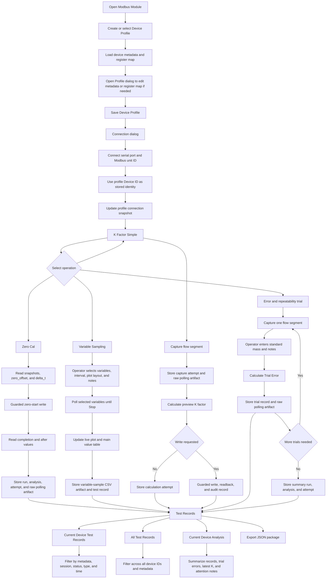

# Modbus Operation Logic

This document describes the current standalone Modbus Module behavior for
operators, developers, and AI-assisted future edits. It is the working contract
for the module UI, runtime services, test records, and safety behavior.

## Scope

The standalone Modbus Module is a direct Modbus RTU master window. It is
independent from the main simulator/replay device list and keeps its own
connection state, variable map, operation dialogs, communication-frame log, and
test-record browser.

This document covers implemented operation logic only. It does not define
production transmitter register maps, production calibration acceptance
thresholds, fixture timing, or customer report templates.

## Shared Operation Context

The Modbus window has a `Device Profile` selector and a stable operator-entered
`Device ID`. This ID is the business identity for the physical transmitter or
meter assembly and must be unique across all devices tested with this program.
It is intentionally separate from the Modbus RTU unit ID. Do not use simple
unit-address values such as `01`, and do not use connection-derived values such
as `modbus:COM9:1` as device IDs.

Each device profile stores these operator-entered device context fields:

- Device Model
- Tube Model
- Transmitter Model

The runtime stores these fields as `ModbusOperationMetadata`. When an operation
writes test records, the metadata snapshot for that operation is attached to
the run configuration, analysis summary metrics, operation-attempt record, and
trial record where applicable with these keys:

- `device_model`
- `tube_model`
- `transmitter_model`

The snapshot is taken at the point where the operation is started or the final
result is calculated. Later edits in the UI must not rewrite a completed
operation's record. The test-record detail pane displays the fields under
`Device Metadata`, and JSON export/import preserves them through the stored run
and analysis records.

## Connection And Variable Map

The operator first creates or selects a `Device Profile`. The main Modbus
window keeps this compact: it shows the profile selector, `New Profile`,
`Edit Profile`, `Delete`, connection controls, and a `Live Variables` table.
The global `All Test Records` browser remains available from the `Operations`
menu. The profile dialog owns the stable device ID,
device metadata, and full register-map configuration. Selecting a saved profile
loads its device metadata, connection settings, and register-map configuration
into the Modbus window. When the module opens, it automatically selects the
most recently used saved profile when that profile still exists, so operators
do not need to reselect the same device every time. Deleting a profile removes
only the reusable profile
configuration; device records and historical test records remain stored under
the original device ID. Old port-derived profiles such as `modbus:COM9:1` are
removed from the profile list automatically; any historical records remain tied
to their original `device_id`.

After a profile is selected, the operator opens `Connection...`, selects a
serial port, Modbus RTU unit ID, serial settings, timeout/retry settings, and
byte/word order. The runtime creates a `ModbusRtuFlowmeterDevice` using the
current variable map and transport. The selected profile's device ID becomes
the stored `device_id`; the Modbus RTU unit ID is stored only as protocol
address and connection metadata.

On connection, the runtime updates the selected Modbus device profile with the
latest connection settings and register-map snapshot, then starts a Modbus test
session. The test session groups operation attempts for later device-centered
review.

The full register map is editable in the profile dialog only while
disconnected. It defines:

- variable name
- Modbus table kind
- address
- word count
- data type
- scale
- unit
- writable flag

The main window's `Live Variables` table deliberately hides the register kind,
address, word count, data type, scale, unit, and writable columns because those
belong to the device profile. The live table keeps only the operator-facing
runtime controls:

- variable name
- poll selection
- current value
- write value
- row read/write operation

Polling and operation reads use the configured map. Adjacent reads may be merged
when they are in the same Modbus table and merging is safe for the operation.

## Device-Centered Test Flow

The standalone Modbus workflow is organized around the active device profile.
Every operation stores enough context to be reviewed later from `Test Records`,
even when the operator rejects the trial or uses it only for diagnosis.



## Variable Reads And Polling

Operators can read a single row with the row `Read` button or poll selected rows
with `Start Polling` for a live table refresh. `Operations > Variable Sampling`
opens a dedicated operation for selected-variable polling, live plotting, and
recording.

The Variable Sampling operation lets the operator choose any configured Modbus
variables, a polling interval, plot layout, and operation notes. `Save Config`
stores the current live-variable selection, polling interval, and plot layout for
the current device profile so the same defaults are restored next time; it does
not separately save sample data. `Start` opens a non-modal live time-value plot,
polls the selected variables until `Stop`, updates the main `Value` column with
the latest saved values, and records a test-history operation. Each sample cycle
is stored as one row in a wide CSV raw artifact:

```text
captured_at,elapsed_s,sample_index,<selected variable columns...>
```

Sample data is saved automatically when the operation stops or reaches its
maximum sample count. The saved artifact uses `curve_type=variable_samples`,
stores units for variables that define a unit in the register map, and is referenced by
`flow_samples_artifact_id` so the Test Records `View Flow Plot`, `View Flow Data`,
and `Compare Flow Plots` controls can reuse the same multi-variable viewer used by
repeatability trial samples.

Test-record operation name:

```text
modbus_variable_sampling
```

Workflow operations continue to read configured variables internally and store
operation-specific raw Modbus polling curves as artifacts.

## Zero Calibration

`Zero Cal` opens a dialog with selectable pre-calibration snapshot variables.
The selected snapshot variables can be saved with `Save Config`; saved zero
calibration configuration is scoped to the current Device ID under the selected
device profile, matching the repeatability configuration behavior.
When the operator clicks `Start`:

1. The UI records the selected snapshot variables and current device metadata.
2. The runtime reads the selected snapshot variables.
3. The runtime reads `zero_offset` and `delta_t` before the operation.
4. The runtime requests a write to `zero_calibration_start` through write guard.
5. The runtime waits for the configured completion delay.
6. The runtime reads completion state plus post-calibration `zero_offset` and
   `delta_t`.
7. The UI refreshes the main variable map values for the result variables.
8. A calibration run, analysis result, operation-attempt test record, and raw
   Modbus polling artifact are stored.

The current implementation uses the configured write guard and records audit
data for the zero-start write. It does not apply production acceptance
thresholds; the operator reviews the before/after values.

Test-record operation name:

```text
zero_calibration
```

## K Factor Simple Mode

`K Factor` opens a dedicated dialog. `Simple` is the implemented mode; advanced
mode is reserved.

The operator selects:

- flow-rate variable
- flow-accumulator variable
- K factor variable
- poll interval
- optional snapshot variables
- standard mass
- whether to record test history
- whether to write the corrected K factor to the device

When the operator clicks `Start`, the runtime captures one flow segment:

1. Capture optional pre-calibration snapshot variables.
2. Read the initial mass accumulator and current K factor.
3. Wait for a nonzero flow-rate segment.
4. Select the instant-flow sample from captured flow samples at the configured
   post-start offset.
5. Wait for the flow rate to return to zero.
6. Read the final mass accumulator after the configured post-stop delay.

When the operator clicks `Calculate`, the runtime computes:

```text
measured_mass_delta = mass_acc_after - mass_acc_before
K1 = K0 / measured_mass_delta * standard_mass
mean_flow = measured_mass_delta / segment_duration_s
```

The capture itself is stored as an operation attempt with a raw Modbus polling
artifact. If history recording is enabled, the calculated result is stored as a
calibration run, analysis result, and operation-attempt test record. If device
write is enabled, the runtime applies the corrected K factor through write
guard, reads it back, marks verification status, and updates the same run.

Test-record operation names:

```text
k_factor_calibration_capture
k_factor_calibration
```

## Repeatability Simple Mode

`Repeatability` opens a dedicated dialog. The operation dialog keeps only the
per-trial `Standard Mass` entry and calculation controls visible. Variables,
mode, target-flow points, polling interval, instant-flow offset,
test-record saving,
all-flow-sample recording, default trial sample variables, and the shared
pre/post trial snapshot selection are
edited from the `Configuration...` dialog before the first trial; once a trial is captured, those operation-level settings are
locked for that operation. The implemented modes are:

The configuration dialog also includes operator notes for the current
error/repeatability operation. Saving the configuration persists those notes
with the current Device ID, the main repeatability operation dialog displays
the saved notes, and every trial completed under that operation copies the same
text into the trial and operation-attempt notes.

Saved repeatability configuration is scoped to the current Device ID under the
selected device profile. There is no global repeatability configuration
fallback; selecting another device profile loads that device's saved
repeatability settings, while an active operation with captured trials keeps its
locked configuration.

- `Three Flow Ranges`
- `Single Flow Range`

Advanced mode is reserved.

Each trial captures one flow segment using the selected flow-rate and
flow-accumulator variables. At the start of each trial, the runtime reads the
operator-selected snapshot variables plus the configured K Factor variable and
updates the operation status while it waits for the non-zero flow segment. If
`Record all flow samples` is enabled in the configuration dialog, `Capture
Trial` first asks the operator to confirm this trial's sample/plot variables.
The same prompt lets the operator choose whether the live plot overlays the
selected variables in one chart or shows one chart per variable. After the
operator confirms, a separate non-modal plot window opens and updates
time-value curves from the captured trial samples using the selected layout.
Operators can click sample points on the live or reopened plots to inspect the
specific trial label, variable, sample index, relative time, capture time, and
value at that point.
The flow-rate variable is
always included because it drives segment start/stop detection; the operator may
add or remove extra variables for that trial. During each sampling cycle the runtime reads
the flow-rate variable and the selected extra variables through the configured
read path, using adjacent-register merge where the device adapter supports it.
If the selected variables take longer than the configured poll interval to read,
the next cycle starts immediately; samples are not discarded. After flow first
exceeds the nonzero threshold, polling continues without an extra post-start
pause; `v1` is selected from the already captured trial samples at the
configured instant-flow offset after flow start, or from the last nonzero sample
if the segment is shorter than the offset. The plot window
does not block the repeatability operation dialog. The same captured sample
points are also written to a wide CSV raw artifact when capture completes, and
the trial history stores the sample artifact ID, sample count, and sampled
variable names.
After the flow segment and ending accumulator read, the runtime reads the same
snapshot variables again as the post-trial snapshot.
The runtime records:

- target flow point
- trial index
- pre-trial selected-variable snapshot and snapshot timestamp
- post-trial selected-variable snapshot and snapshot timestamp
- configured K Factor variable name
- original K factor value automatically read before the flow segment
- mass accumulator before and after the segment
- measured mass delta
- standard mass entered by the operator
- instant flow selected from the captured samples at the configured
  instant-flow offset after flow start
- mean flow across the captured segment
- percent error
- capture-click timestamp
- flow segment timestamps: start, instant sample, and end
- trial status, currently `accepted` by default
- raw Modbus polling artifact ID
- trial sample CSV artifact ID, sample count, and sampled variable names when
  all-flow-sample recording is enabled

The Test Records timestamp for each trial is the time the operator clicks
`Capture Trial`. It is not the flow-segment start, instant-sample, end, or trial
error calculation/save timestamp. The calculation/save timestamp remains stored
as `calculated_at`, and the flow-segment timestamps remain stored in the trial
metrics and raw polling artifact for traceability.

Trial percent error is:

```text
e = (measured_mass_delta - standard_mass) / standard_mass * 100%
```

Where:

- `measured_mass_delta = mass_acc_after - mass_acc_before`
- `standard_mass` is the standard-scale mass entered by the operator for that
  trial.
- `v1` is selected from the captured real-time flow samples at the configured
  instant-flow offset after flow start; if the flow segment is shorter than
  that offset, the last nonzero sample is used.
- `v_mean = measured_mass_delta / flow_segment_duration_s`.
- `original_k` is read automatically from the configured K Factor variable at
  the start of each trial.

For `Three Flow Ranges`, the complete result contains 3 flow points and 3 trials
per flow point. `Capture Trial` captures the device-side flow segment and leaves
it as the current pending capture. The operator then enters `Standard Mass` and
clicks `Calculate Trial Error`; that action calculates the percent error and
stores the trial record. There is no separate `Save Trial` action. Closing the
dialog before all 9 trials are complete leaves already calculated trials in test
records, discards any pending uncalculated capture from the dialog state, and
the next open starts a new operation rather than resuming the old dialog state.
After any flow point has 3 calculated trials, `Add Trial` becomes available.
Clicking it opens a flow-point selection dialog. The default selection is the
most recently completed flow point that already has at least 3 trials, and the
operator may choose any flow point that has reached that condition. The extra
trial is appended to the table as a pending row and is stored as another trial
record after `Calculate Trial Error` without deleting earlier data.

Standard three-flow-range ordering is flexible through the configured target
flow points, but the base operation is still interpreted as:

```text
flow_point_1: trial 1, trial 2, trial 3
flow_point_2: trial 1, trial 2, trial 3
flow_point_3: trial 1, trial 2, trial 3
```

Additional trials are appended after these base rows. They are available for
diagnosis or for selecting a later consecutive three-trial window; earlier
trials are not cleared or overwritten.

For `Single Flow Range`, the operator may save any number of trials for one flow
point. The UI refreshes the current summary after each `Calculate Trial Error`
calculation stores a trial, and the refreshed error/repeatability summary is
saved as a `manual_error_repeatability` test record using the operation notes
from the repeatability configuration. Final K calculation is not available until
the operator has selected three flow points with three consecutive trials each.

`Calculate Repeatability` opens a selection dialog. The operator chooses one
flow point and one consecutive three-trial window from the current operation.
The UI calculates the sample standard deviation of those three trial percent
errors and saves the selected-window calculation as a
`manual_error_repeatability` test record using the operation notes from the
repeatability configuration. The Test Records timestamp for this repeatability
record is the time the repeatability result is calculated and saved, while the
selected trial time range remains in `source_trial_started_at` and
`source_trial_ended_at`. The operator may repeat this selection;
recalculating a flow point refreshes the selected repeatability value and shows
the change.

For one selected flow point with three selected trial errors:

```text
selected_mean_error = (e1 + e2 + e3) / 3
repeatability_stddev = sqrt(((e1 - selected_mean_error)^2
                           + (e2 - selected_mean_error)^2
                           + (e3 - selected_mean_error)^2) / (3 - 1))
```

The `Selected Trials And K Preview` text line shows this value as `mean`. For
example, if a selected flow point has trial errors `0%`, `2%`, and `-2%`, the
displayed `mean` is:

```text
mean = (0 + 2 + -2) / 3 = 0%
```

This displayed `mean` is the selected three-trial mean error for one flow point.
It is not the final `average_error` used to normalize the three flow-point
measurement errors during final K calculation.

`Calculate Final K` uses the three operator-selected repeatability windows
(9 selected trials total). For each flow point, the measurement error is the
mean percent error of its three selected trials:

```text
measurement_error_j = (e_j1 + e_j2 + e_j3) / 3
```

The final-K calculation then uses:

```text
average_error = (max(measurement_error_1,
                     measurement_error_2,
                     measurement_error_3)
               + min(measurement_error_1,
                     measurement_error_2,
                     measurement_error_3)) / 2

adjusted_error_j = measurement_error_j - average_error

intermediate_k_j = original_k / (1 + measurement_error_j / 100)

new_k = (max(intermediate_k_1,
             intermediate_k_2,
             intermediate_k_3)
       + min(intermediate_k_1,
             intermediate_k_2,
             intermediate_k_3)) / 2

delta_k = new_k - original_k
```

`adjusted_error_j` remains stored and displayed for review, but
`intermediate_k_j` and the resulting `new_k` are calculated from
`measurement_error_j`. `original_k` is read automatically from the configured K
Factor variable during
each trial; the operator does not type this value into the dialog. Final K
calculation requires all 9 selected trials to come from the same operation, use
the same flow-rate and flow-accumulator variables, use the same K Factor
variable, and share the same original K value. Repeating this action overwrites
the previous final-K record for the same operation, while all trial records
remain intact. K values, intermediate K values, and `delta_k` are displayed
with enough decimal precision for manual entry into a slave device.
The final-K preview record also carries the same operation notes.

After a final-K preview exists, `Write New K...` becomes available. This is an
explicit write action, not part of the calculation itself. The UI shows a
confirmation dialog with the current Device ID, K Factor variable, original K,
new K, and delta. If the operator confirms, the runtime writes the new K only
through `WriteGuardService`, reads the same K Factor variable back, verifies the
readback against the requested value, records an audit log entry, and updates
the final-K test record with `write_requested`, `write_status`,
`write_verified`, `readback_k_factor`, and `audit_id`. Canceling the dialog
leaves the preview saved but does not write the device.

Repeatability per flow point is the sample standard deviation of the trial
percent errors. The summary also stores mean percent error, maximum absolute
percent error, trial count, per-flow summaries, and trial details.

Test-record operation names:

```text
manual_error_repeatability_trial
manual_error_repeatability
manual_error_repeatability_final_k
```

## Test Records

`Test Records` replaces the old `Calibration History` UI label. Test records
are derived from Modbus operation-attempt rows and remain compatible with older
run/analysis history rows. These operation names are shown:

- `zero_calibration`
- `k_factor_calibration_capture`
- `k_factor_calibration`
- `manual_error_repeatability_trial`
- `manual_error_repeatability`
- `manual_error_repeatability_final_k`

The UI exposes two record windows:

- `Current Device Test Records` opens with the selected or connected device ID
  locked as a filter.
- `All Test Records` opens the global record browser for every device tested
  with this program.

The record table and detail pane display units for values whose units are known
from the saved operation register-map snapshot or saved sample metadata. Derived
trial values use the configured flow-rate, accumulated-mass, and K-factor
variables to resolve their units, so historical records remain tied to the
variable map that was active when the operation was written.

If a repeatability trial has a saved trial-sample CSV artifact, the record
browser enables `View Flow Plot` and `View Flow Data` for that selected trial.
`View Flow Data` opens the saved samples in a table with capture time, elapsed
time, sample index, flow, and any extra sampled variables. The table's capture
time column is formatted in local UI time; the saved CSV artifact keeps raw
`captured_at` timestamps in UTC ISO format for traceability. Selecting multiple
trial records, or a repeatability summary that contains multiple saved trial
artifacts, enables `Compare Flow Plots`; that action first opens a trial picker
so the operator can choose exactly which saved trial artifacts to compare. The
comparison plot shows the chosen trials on a shared relative-time axis where the
first sample of each trial is aligned to 0 seconds by default. The plot window
includes a variable selector so the operator can show only flow, only another
sampled variable, or multiple variables together. It also includes plot-layout
and alignment selectors: layout switches between overlaying selected variables
in one chart and showing one chart per variable, and alignment switches between
the first sample and the sample immediately before the first nonzero flow-rate
sample. When overlay mode shows exactly two variables, the first selected
variable uses the left Y axis and the second selected variable uses the right Y
axis, so multiple trials can be compared without forcing unlike variables onto
one scale. Clicking a plotted sample point shows the exact trial, variable,
sample index, relative time, capture time, value, and unit for that point.

The `Current Device Analysis` operation opens a single-purpose calculation
dialog for the selected or connected Device ID. The dialog does not show a
device-history text summary or a per-flow summary table. It only lets the
operator select 9 saved trials, calculate the repeatability/final-K result, and
save the report. This dialog does not encode hidden pass/fail thresholds and
does not write to the device.

`Select And Calculate...` shows each accepted trial record
as its own selectable row, including Attempt ID, Run ID, old K, error, raw
artifact reference, and comparison values, so the row can be matched directly
to the Test Records detail. Rows are ordered by trial start time with the most
recent trial at the top, and the selection table columns can be reordered by
dragging the column headers. The operator must select exactly 9 rows covering
exactly three flow points; each flow point must have exactly three selected
trials, and those three trial indexes must be consecutive. No trial rows are
selected by default. The
comparison variables shown in the selection dialog are selected with checkboxes
from a dedicated variable-selection popup. Clicking `Save` stores the selection
per Device ID under
`config/workflow_templates/devices/<device>/modbus_device_analysis.json` and
closes the popup. The default comparison variables are `zero_offset` and
`low_threshold`.

After the 9-trial selection is valid, the selection dialog calculates the
per-flow adjusted error, per-flow repeatability, and old/new K preview before it
can be accepted. The preview text shows one line per flow point in the form
`Flow <value>g/s: adjusted_error=<value>%, repeatability=<value>%`, followed by
`K value: old=<value>, new=<value>`.

Before the result is saved, the runtime verifies that all 9 selected trials
share the same original K factor and the same `zero_offset` and `low_threshold`
values from their pre-calibration snapshots. Missing or mismatched values stop
the operation and show the operator a warning. Unlike the live repeatability
`Calculate Final K` action, device analysis can use selected saved trials from
more than one repeatability operation and records the source run IDs in the
report metrics. `Save` writes the previously calculated selection as a
plain-text report artifact, and records the action as
`manual_error_repeatability_final_k` with
`analysis_source=current_device_analysis`. It does not apply the new K to the
device. The saved report text is intentionally narrow: it lists only the 9
selected trial rows, the pre-calibration consistency values used for those
trials, the per-flow repeatability/final-K intermediate calculations, and the
final K result. Device-analysis provenance such as source run IDs remains in
structured metrics, not in the operator report text.

After `Save`, the new record appears in `Current Device Test
Records` for that Device ID and in `All Test Records`. Use operation filter
`Repeatability Final K` or `Repeatability`, and status filter `Any Status` or
`Calculated`. Its parameter summary shows the calculated `new_k` and
`delta_k` plus `average_error`; the report artifact is listed in the detail pane. The test
record timestamp is the time this report calculation/save action was performed,
not the historical time range of the selected trials. The selected-trial time
range remains traceable in the record metrics as `source_trial_started_at` and
`source_trial_ended_at`.

The record table shows timestamp, operation, run ID or attempt ID, parameter summary, and
operator notes. The detail pane shows:

- basic run metadata
- result summary
- device metadata
- pre-calibration snapshot
- raw artifact references
- remaining metrics

Notes are stored on the run session when a run exists. JSON export writes a
portable package that includes device records, run sessions, workflow steps,
analysis results, artifact metadata and file content, Modbus test sessions,
operation attempts, and trial records. This includes repeatability
trial-sample CSV artifacts, so saved flow and extra-variable curves can be
opened after import on another PC. Import remains compatible with older package
shapes that only contain artifact metadata: missing artifact file content is
left unavailable and reported when a plot is opened. Missing Modbus test
sessions are backfilled from the referenced attempts/trials. When
the import is launched from `Current Device Test Records`, imported run,
session, attempt, and trial Device IDs are retargeted to the current Device ID
while preserving the original Device ID in metadata.

Import skips exact duplicate runs and renames conflicting imported run IDs.

Excel export is reserved for a later release.

## Safety Rules For Future Operation Changes

Future edits must preserve these rules:

- Do not write device parameters without write guard and audit logging.
- Do not silently treat placeholder register maps as production maps.
- Keep operation metadata snapshots stable for the history entry being written.
- Keep runtime logic testable without the Qt UI.
- Store formulas, thresholds, fixture behavior, and customer-specific rules as
  configuration or explicitly documented implementation, not hidden constants.
- Update this document whenever operation sequence, calculation, persistence, or
  history fields change.
