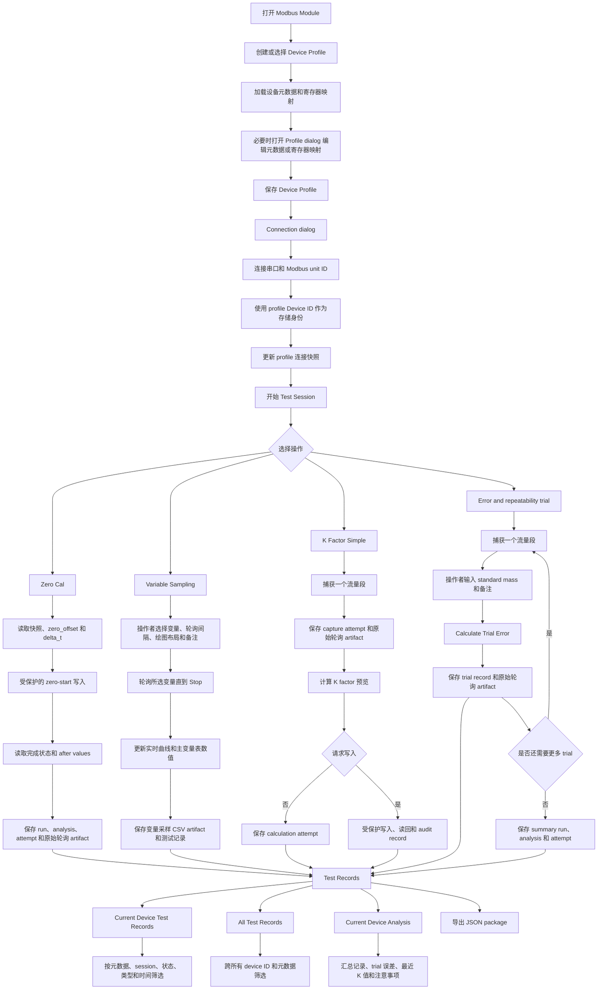

# Modbus 操作逻辑

本文档描述当前独立 `Modbus Module` 的已实现行为，面向操作者、开发者，以及后续由 AI 辅助维护时的上下文理解。它是 Modbus 模块 UI、运行时服务、测试记录和安全行为的工作契约。

## 范围

独立 `Modbus Module` 是一个直接操作 Modbus RTU 从机的主站窗口。它独立于主窗口中的模拟器/回放设备列表，并维护自己的连接状态、变量映射、操作弹窗、通信帧日志和测试记录浏览器。

本文档只覆盖已经实现的操作逻辑。它不定义生产用变送器寄存器表、生产校准合格阈值、夹具时序或客户报告模板。

## 共享操作上下文

Modbus 窗口包含一个 `Device Profile` 选择器和一个由操作者输入的稳定 `Device ID`。这个 ID 是物理变送器或整表组件的业务身份，在使用本程序测试过的所有设备中必须唯一。

`Device ID` 与 Modbus RTU 的 `Unit ID` 是两个不同概念。不要使用 `01` 这类简单从机地址作为设备 ID，也不要使用 `modbus:COM9:1` 这类连接推导出来的值作为设备 ID。

每个设备档案保存以下由操作者维护的设备上下文字段：

- Device Model
- Tube Model
- Transmitter Model

运行时将这些字段保存为 `ModbusOperationMetadata`。当操作写入测试记录时，该操作的元数据快照会附加到 run 配置、分析汇总指标、operation attempt 记录，以及适用的 trial 记录中。字段名为：

- `device_model`
- `tube_model`
- `transmitter_model`

快照在操作启动或最终结果计算时生成。之后 UI 中对设备档案的编辑不得回写已经完成的操作记录。测试记录详情窗会在 `Device Metadata` 下展示这些字段，JSON 导出/导入会通过已存储的 run 和 analysis 记录保留这些字段。

## 连接与变量映射

操作者首先创建或选择一个 `Device Profile`。Modbus 主窗口保持紧凑：只显示设备档案选择器、`New Profile`、`Edit Profile`、`Delete`、连接控件和 `Live Variables` 表。全局 `All Test Records` 浏览器仍然从 `Operations` 菜单打开。

设备档案弹窗负责维护稳定设备 ID、设备元数据和完整寄存器映射配置。选择一个已保存档案后，Modbus 窗口会加载该设备的元数据、连接设置和寄存器映射。模块打开时，如果上一次使用的设备档案仍然存在，会自动选择它，避免操作者每次都重新选择同一设备。

删除设备档案只删除可复用的 profile 配置；设备记录和历史测试记录仍然按照原 `device_id` 保留。旧的端口推导档案，例如 `modbus:COM9:1`，会从档案列表中自动移除；任何历史记录仍然绑定到它们原本的 `device_id`。

选择设备档案后，操作者打开 `Connection...`，选择串口、Modbus RTU `Unit ID`、串口参数、超时/重试参数，以及 byte/word order。运行时使用当前设备档案的寄存器映射和 transport 创建 `ModbusRtuFlowmeterDevice`。已选档案的 `Device ID` 会成为存储用 `device_id`；Modbus RTU `Unit ID` 只作为协议地址和连接元数据保存。

连接时，运行时会使用设备档案中的寄存器映射，并只将连接弹窗中的 byte/word order 应用到这份映射。`Live Variables` 表不再作为寄存器配置来源，避免主表显示状态覆盖设备档案配置。

连接成功后，运行时会把最新连接设置和寄存器映射快照更新到选中的 Modbus 设备档案，并启动一个 Modbus 测试会话。测试会话用于把后续 operation attempts 组织到同一次设备测试上下文中，便于之后按设备查看。

完整寄存器映射只允许在断开连接时通过设备档案弹窗编辑。映射字段包括：

- variable name
- Modbus table kind
- address
- word count
- data type
- scale
- unit
- writable flag

主窗口的 `Live Variables` 表刻意隐藏 register kind、address、word count、data type、scale、unit 和 writable 列，因为这些属于设备档案配置。主表只保留操作者运行时需要看到和操作的内容：

- variable name
- poll selection
- current value
- write value
- row read/write operation

轮询和操作读取都使用已配置的寄存器映射。当变量属于同一个 Modbus table 且合并安全时，相邻读取可以合并。

## 以设备为中心的测试流程

独立 Modbus 工作流围绕当前激活的设备档案组织。每个操作都会保存足够的上下文，以便之后在 `Test Records` 中复查。即使操作者拒绝某次 trial，或只把它作为诊断数据使用，也不应丢弃记录。



## 变量读取与轮询

操作者仍然可以使用每一行的 `Read` 按钮读取单个变量，也可以用 `Start Polling` 轮询勾选的变量并刷新主表。`Operations > Variable Sampling` 会打开一个专门的操作，用于轮询用户指定的变量、实时画图并记录。

Variable Sampling 操作允许操作者选择任意已配置 Modbus 变量、轮询间隔、绘图布局和操作备注。`Save Config` 会把当前选择的实时变量、轮询间隔和绘图布局保存到当前设备档案，下次打开同一设备时自动恢复；它不单独保存采样数据。点击 `Start` 后会打开独立的非模态实时 time-value 图，按设置轮询所选变量直到操作者点击 `Stop`，并用最后保存的样本刷新主变量表的 `Value` 列。每个采样周期保存为宽表 CSV raw artifact 的一行：

```text
captured_at,elapsed_s,sample_index,<selected variable columns...>
```

采样数据在操作停止或达到最大样本数后自动保存，不需要额外点击保存。保存的 artifact 使用 `curve_type=variable_samples`，对寄存器表中带单位的变量记录单位，并通过 `flow_samples_artifact_id` 引用，因此 Test Records 里的 `View Flow Plot`、`View Flow Data` 和 `Compare Flow Plots` 可以复用误差和重复性测试样本的多变量曲线/表格查看器。

测试记录 operation name：

```text
modbus_variable_sampling
```

工作流操作仍会在内部读取配置变量，并把与该操作相关的原始 Modbus 轮询曲线保存为 artifact。

## 零点校准

`Zero Cal` 会打开一个弹窗，操作者可以选择零点校准前要读取的快照变量。当操作者点击 `Start`：

1. UI 记录已选择的快照变量和当前设备元数据。
2. 运行时读取所选快照变量。
3. 运行时读取操作前的 `zero_offset` 和 `delta_t`。
4. 运行时通过 write guard 请求写入 `zero_calibration_start`。
5. 运行时等待配置的完成延时。
6. 运行时读取完成状态，以及校准后的 `zero_offset` 和 `delta_t`。
7. UI 刷新主变量映射中的相关结果变量值。
8. 程序保存 calibration run、analysis result、operation-attempt 测试记录，以及原始 Modbus 轮询 artifact。

当前实现会使用已配置的 write guard，并记录 zero-start 写入的 audit 数据。它不应用生产合格阈值；操作者需要自行查看 before/after 数值。

测试记录 operation name：

```text
zero_calibration
```

## K Factor Simple 模式

`K Factor` 会打开独立弹窗。当前已实现的是 `Simple` 模式；advanced mode 预留。

操作者选择：

- flow-rate variable
- flow-accumulator variable
- K factor variable
- poll interval
- optional snapshot variables
- standard mass
- 是否记录测试历史
- 是否把修正后的 K factor 写入设备

当操作者点击 `Start`，运行时捕获一个流量段：

1. 捕获可选的 pre-calibration snapshot variables。
2. 读取初始 mass accumulator 和当前 K factor。
3. 等待非零流量段开始。
4. 按配置的 instant-flow offset，从已经采到的实时流量样点中选取 instant-flow sample。
5. 等待流量回到零。
6. 在配置的 post-stop delay 之后读取最终 mass accumulator。

当操作者点击 `Calculate`，运行时计算：

```text
measured_mass_delta = mass_acc_after - mass_acc_before
K1 = K0 / measured_mass_delta * standard_mass
mean_flow = measured_mass_delta / segment_duration_s
```

capture 本身会保存为 operation attempt，并附带原始 Modbus 轮询 artifact。如果启用了历史记录，计算结果会保存为 calibration run、analysis result 和 operation-attempt 测试记录。如果启用了设备写入，运行时会通过 write guard 应用修正后的 K factor，读回验证，标记验证状态，并更新同一个 run。

测试记录 operation names：

```text
k_factor_calibration_capture
k_factor_calibration
```

## Repeatability Simple 模式

`Repeatability` 会打开独立弹窗。主操作弹窗只保留每个 trial 需要输入的 `Standard Mass` 和计算控制。`Standard Mass` 输入框不显示上下箭头，后缀显示 `g`，其数值作为该 trial 的标准称质量参与误差计算。

变量、模式、目标流量点、轮询间隔、instant-flow offset、是否保存测试记录、是否记录所有流量采样点、默认 trial 采样变量，以及前/后 trial 共用的一套 snapshot 选择，都在第一次 trial 之前通过 `Configuration...` 弹窗编辑。一旦某个 trial 被捕获，该次操作的这些 operation-level 设置会锁定。

已实现模式：

- `Three Flow Ranges`
- `Single Flow Range`

Advanced mode 预留。

保存的 repeatability 配置绑定到当前选中的设备档案 `Device ID`。没有全局 repeatability 配置兜底。选择另一个设备档案会加载该设备自己的 repeatability 配置；如果当前操作已经捕获 trial，则保持该操作已锁定的配置。

每个 trial 捕获一个流量段，使用已选择的 flow-rate 和 flow-accumulator 变量。每次 trial 开始时，运行时会读取操作者选择的 snapshot 变量以及配置的 K Factor 变量，并在操作状态中更新当前进度，然后等待非零流量段；这个预读取过程不再弹出读取完成提示。如果启用记录所有流量采样点，点击 `Capture Trial` 后会先让操作者确认本次 trial 的采样/绘图变量，并选择实时图是把变量叠加在同一张图里，还是每个变量单独一张图；确认后会打开独立的非模态时间-数值曲线弹窗，随已采集的 trial 样点按所选布局实时更新，且不阻塞 Repeatability 操作弹窗。flow-rate 变量始终采集，因为它用于判断流量段起停；操作者可为本次 trial 增减要同步采集和显示的额外变量。每个采样周期内，运行时会通过配置的读取路径读取 flow-rate 和额外变量，设备适配器支持时会合并相邻寄存器读取；如果所选变量读取耗时超过配置的轮询间隔，下一轮会立即开始，不丢弃已经采到的样点。流量开始后不会为了 `v1` 额外暂停轮询；运行时会按配置的 instant-flow offset，从已采到的实时样点中选择 `v1`，如果流量段短于该 offset，则使用最后一个非零样点。同一批样点会在 capture 完成时写入宽表 CSV raw artifact，trial 历史会保存该 sample artifact ID、sample count 和采样变量名。流量段和结束累积量读取完成后，运行时会用同一套 snapshot 变量再读取一次，作为 post-trial snapshot。运行时记录：

- target flow point
- trial index
- pre-trial selected-variable snapshot 和 snapshot timestamp
- post-trial selected-variable snapshot 和 snapshot timestamp
- configured K Factor variable name
- 流量段开始前自动读取的 original K factor value
- mass accumulator before/after
- measured mass delta
- 操作者输入的 standard mass
- 按配置 instant-flow offset 从实时样点中选取的 instant flow
- 捕获流量段的 mean flow
- percent error
- capture-click timestamp
- flow segment timestamps：start、instant sample、end
- trial status，目前默认为 `accepted`
- raw Modbus polling artifact ID
- 启用所有流量采样点记录时的 trial sample CSV artifact ID、sample count 和采样变量名

每个 trial 在测试记录表中的时间是操作者点击 `Capture Trial` 的时刻；不是流量段 start、instant sample、end，也不是后续点击 `Calculate Trial Error` 计算并保存误差的时刻。误差计算/保存完成时间会作为 `calculated_at` 保留在详情指标中。

trial percent error 计算为：

```text
e = (measured_mass_delta - standard_mass) / standard_mass * 100%
```

其中：

- `measured_mass_delta = mass_acc_after - mass_acc_before`
- `standard_mass` 是操作者为该 trial 输入的标准称质量。
- `v1` 是按配置 instant-flow offset 从实时流量样点中选取的瞬时流量样本；如果流量段短于该 offset，则使用最后一个非零样点。
- `v_mean = measured_mass_delta / flow_segment_duration_s`。
- `original_k` 在每个 trial 开始时自动从配置的 K Factor 变量读取。

对于 `Three Flow Ranges`，完整基础结果包含 3 个流量点，每个流量点 3 次 trial，共 9 次。`Capture Trial` 只捕获设备侧流量段数据，并把它保留为当前 pending capture。操作者随后输入或确认 `Standard Mass`，再点击 `Calculate Trial Error`；这个动作会计算该 trial 的 percent error，并保存 trial record。不存在单独的 `Save Trial` 操作。

如果在未完成 9 次 trial 时关闭弹窗，已经计算并保存的 trial 仍然保存在测试记录中；尚未点击 `Calculate Trial Error` 的 pending capture 不会作为 trial record 保存。下次打开会开始新的操作，不恢复上次未完成的弹窗状态。

任意一个流量点已经完成 3 次计算并保存的 trial 后，`Add Trial` 就会变为可用。点击 `Add Trial` 会弹出流量点选择弹窗；默认流量点是当前最近完成且已至少有 3 次 trial 的流量点。操作者也可以选择任何已经达到 3 次 trial 的流量点。确认后，程序会在表格末尾追加一行 pending trial，并自动计算该流量点的下一个 trial index。操作者随后点击 `Capture Trial` 捕获这次额外 trial，输入新的 `Standard Mass`，再点击 `Calculate Trial Error`。额外 trial 会作为新的 trial record 保存，不会删除或覆盖之前的 trial。

如果还没有任何流量点完成 3 次 trial，`Add Trial` 保持不可用。

标准 three-flow-range 的基础行顺序可以由配置的目标流量点灵活决定，但基础操作仍解释为：

```text
flow_point_1: trial 1, trial 2, trial 3
flow_point_2: trial 1, trial 2, trial 3
flow_point_3: trial 1, trial 2, trial 3
```

额外 trial 会追加在这些基础行之后。它们可用于诊断，也可用于之后选择一个连续三次 trial 的窗口；更早的 trial 不会被清空或覆盖。

对于 `Single Flow Range`，操作者可以为一个流量点保存任意数量的 trial。每次点击 `Calculate Trial Error` 保存 trial 后，UI 会刷新当前 summary。只有当操作者已经为三个流量点分别选择了连续三次 trial 后，最终 K 计算才可用。

`Calculate Repeatability` 会打开选择弹窗。操作者选择一个流量点，以及当前操作中该流量点下连续的三次 trial。UI 会计算这三个 trial percent errors 的样本标准差。操作者可以重复选择；重新计算某个流量点会刷新已选择的 repeatability 值，并显示变化。

对一个已选择流量点的三次 trial error：

```text
selected_mean_error = (e1 + e2 + e3) / 3
repeatability_stddev = sqrt(((e1 - selected_mean_error)^2
                           + (e2 - selected_mean_error)^2
                           + (e3 - selected_mean_error)^2) / (3 - 1))
```

`Selected Trials And K Preview` 文本中的 `mean` 指的是这个值中的 `selected_mean_error`。例如某个流量点选择的三次误差为 `0%`、`2%` 和 `-2%`，显示的 `mean` 为：

```text
mean = (0 + 2 + -2) / 3 = 0%
```

这个 `mean` 是某一个流量点下已选三次 trial 的平均误差。它不是最终 K 计算中用于规范化三个流量点测量误差的 `average_error`。

`Calculate Final K` 使用操作者为三个流量点选择的 repeatability windows，总计 9 次 selected trials。对每个流量点，其 measurement error 为该流量点三次 selected trials 的 percent error 平均值：

```text
measurement_error_j = (e_j1 + e_j2 + e_j3) / 3
```

最终 K 计算使用：

```text
average_error = (max(measurement_error_1,
                     measurement_error_2,
                     measurement_error_3)
               + min(measurement_error_1,
                     measurement_error_2,
                     measurement_error_3)) / 2

adjusted_error_j = measurement_error_j - average_error

intermediate_k_j = original_k / (1 + measurement_error_j / 100)

new_k = (max(intermediate_k_1,
             intermediate_k_2,
             intermediate_k_3)
       + min(intermediate_k_1,
             intermediate_k_2,
             intermediate_k_3)) / 2
```

`adjusted_error_j` 仍会保存和显示，供复核使用，但 `intermediate_k_j` 以及最终 `new_k` 使用 `measurement_error_j` 计算。`original_k` 在每个 trial 开始时自动从配置的 K Factor 变量读取；操作者不在弹窗中手动输入该值。最终 K 计算要求 9 次 selected trials 来自同一个 operation，使用相同的 flow-rate、flow-accumulator 和 K Factor 变量，并共享相同 original K 值。重复点击该操作会覆盖同一 operation 的上一条 final-K record，但所有 trial records 都保持不变。

生成 final-K preview 后，`Write New K...` 会变为可用。这是一个显式写入动作，不属于计算动作本身。UI 会显示确认弹窗，包含当前 Device ID、K Factor 变量、original K、new K 和 delta。如果操作者确认，运行时只会通过 `WriteGuardService` 写入新 K，随后读取同一个 K Factor 变量并验证 readback 是否匹配请求值，同时记录 audit log，并把 final-K 测试记录更新为包含 `write_requested`、`write_status`、`write_verified`、`readback_k_factor` 和 `audit_id`。取消确认弹窗会保留 preview，但不会写入设备。

每个流量点的 repeatability 是 trial percent errors 的样本标准差。summary 还保存 mean percent error、maximum absolute percent error、trial count、per-flow summaries 和 trial details。

测试记录 operation names：

```text
manual_error_repeatability_trial
manual_error_repeatability
manual_error_repeatability_final_k
```

## 测试记录

`Test Records` 替代旧的 `Calibration History` UI 标签。测试记录来自 Modbus operation-attempt 行，并兼容旧的 run/analysis history 行。当前展示这些 operation names：

- `zero_calibration`
- `k_factor_calibration_capture`
- `k_factor_calibration`
- `manual_error_repeatability_trial`
- `manual_error_repeatability`
- `manual_error_repeatability_final_k`

UI 暴露两个记录窗口：

- `Current Device Test Records` 使用当前选中或已连接的 device ID 作为锁定筛选条件。
- `All Test Records` 打开全局记录浏览器，显示本程序测试过的所有设备。

记录表和详情窗会为已知单位的值显示单位。单位来源是保存该 operation
时的 register-map snapshot 或保存的 sample metadata；派生 trial 值会根据当时配置的
flow-rate、accumulated-mass 和 K-factor 变量解析单位，因此历史记录不会被之后的变量映射修改影响。

如果 repeatability trial 保存了 trial-sample CSV artifact，记录浏览器会对该选中 trial 启用 `View Flow Plot` 和 `View Flow Data`。`View Flow Data` 会用表格显示已保存样点，包含采集时间、相对时间、sample index、flow 以及本次 trial 同步采集的额外变量。表格里的采集时间按本机界面时区显示；保存的 CSV artifact 仍保留 UTC ISO 格式的原始 `captured_at` 时间戳，用于追溯。选择多条 trial 记录，或选择包含多条已保存 trial artifact 的 repeatability summary 时，会启用 `Compare Flow Plots`；点击后会先打开 trial 选择弹窗，由操作者勾选具体要比较的 trial artifact。比较图默认将所选 trial 的第一个采样点对齐为 0 秒；操作者也可以在图窗中把对齐方式切换为“有流量前的那个样点”，也就是第一个非零 flow-rate 样点前一帧。图窗内有变量选择表、图布局选择和对齐方式选择，可只看 flow，也可只看某个额外变量，或同时显示多个变量；显示方式可以在“多个变量叠加到同一张图”和“每个变量单独一张图”之间切换。当叠加模式中刚好选择两个变量时，第一个变量使用左侧 Y 轴，第二个变量使用右侧 Y 轴，便于在同一图中比较多个 trial 的两个不同量纲变量。

`Current Device Analysis` 是围绕当前选中或已连接 Device ID 的只读分析操作。它汇总测试记录数量、测试会话数量、operation 数量、trial 状态数量、accepted trial 的 mean/stddev/max absolute error、每个流量点的 accepted-trial summary、最近一次 final-K preview、最近一次简单 K 结果、最近一次零点校准结果，以及例如“没有 final-K preview”或“某流量点 accepted trial 少于三次”这样的注意事项。该窗口不编码合格阈值，也不会写入从机设备；它用于在导出或离线深度分析前快速查看某个设备的历史趋势。

记录表展示 timestamp、operation、run ID 或 attempt ID、parameter summary 和 operator notes。详情窗展示：

- basic run metadata
- result summary
- device metadata
- pre-calibration snapshot
- raw artifact references
- remaining metrics

当存在 run 时，notes 会保存在 run session 上。JSON 导出会写出一个可移植 package，其中包含 device records、run sessions、workflow steps、analysis results、artifact metadata 和文件内容、Modbus test sessions、operation attempts 和 trial records。repeatability 的 trial-sample CSV artifact 也会随包导出，因此导入到另一台电脑后仍可打开已保存的流量和额外变量曲线。

导入保持兼容旧的 run/analysis package 结构：旧包如果只包含 artifact metadata 而没有 artifact 文件内容，记录仍可导入，但打开曲线时会提示对应文件不可用；完全重复的 run 会跳过；run ID 冲突但内容不同的导入记录会重命名。

Excel 导出预留给后续版本。

## 未来操作变更的安全规则

后续修改必须保留以下规则：

- 未经过 write guard 和 audit logging，不得写入设备参数。
- 不得静默地把 placeholder register map 当成生产 map 使用。
- 已写入历史记录的 operation metadata snapshots 必须保持稳定。
- runtime 逻辑必须保持可在没有 Qt UI 的情况下测试。
- formulas、thresholds、fixture behavior 和 customer-specific rules 应作为配置项或明确文档化实现，不要隐藏成代码常量。
- 当操作顺序、计算、持久化或历史字段发生变化时，必须更新本文档。
